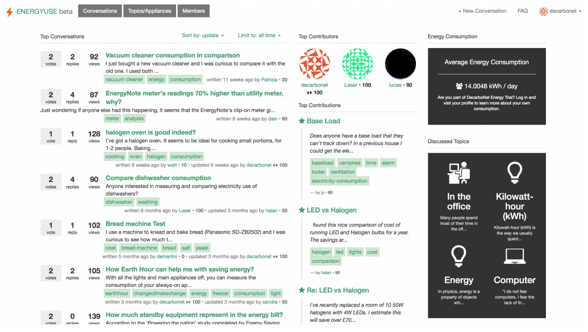
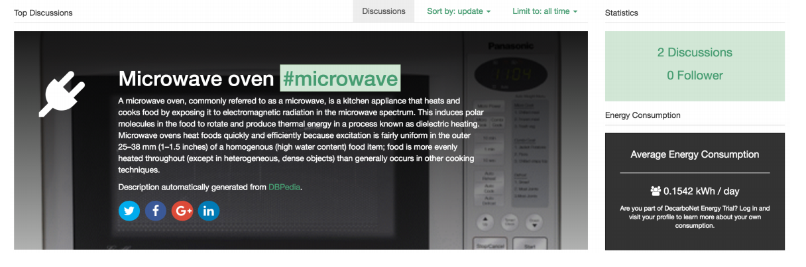

# ")

> :warning: The EnergyUse platform code is unmaintened and will not be updated.

EnergyUse was [DecarboNet](https://www.decarbonet.eu) online community for sharing real-life experiences on the energy consumption of typical appliances. The platform is based on the [Biostar Q&A platform](https://github.com/ialbert/biostar-central).

Using the electricity monitors provided by [Green Energy Options](https://www.geotogether.com/), people can compare the consumption of similar appliances, test different settings to perform daily activities like doing the laundry, hoovering, etc. They can also assess the efficiency of changes in energy behaviour.

Users can navigate discussions by tags associated to appliances or contexts of energy usage (e.g., working in the office, breakfast). Discussions are open to everyone, but users of energy-monitoring devices from Green Energy Options, can also view the electricity consumption of specific devices and appliances, or of their entire households, and compare with the community’s average.

The platform collects data from smart plugs, and exports appliance consumption information and community generated energy tips as [linked data](http://www.essepuntato.it/lode/http://socsem.open.ac.uk/ontologies/eu).


If you use this code, please cite the following publication:
- Burel, G., Piccolo, L. and Alani, H (2016). *[EnergyUse – A Collective Semantic Platform for Monitoring and Discussing Energy Consumption](http://www-kasm.nii.ac.jp/iswc2016/papers/paper_A47_.pdf)*. In Proceedings of the 15th International Semantic Web Conference.


## Features
- A question Answering platform based on the [Biostar Q&A platform](https://github.com/ialbert/biostar-central).
- Automatic semantic tagging of posts (deactivated by default).
- Automatic semantic description of topics and appliances (deactivated by default).
- Energy consumption data collection and visualisation (deactivated by default, only works for DecarboNet trial users).
- Linksed Data support using the [EnergyUse Ontology](http://www.essepuntato.it/lode/http://socsem.open.ac.uk/ontologies/eu) ontology.





## Docker Installation and Usage
You can run a barebone version of EnergyUse using [docker](https://docker.com/). The container does not automatically update tags and index the content (see the different commands using manage.py and the [Biostar README.md](README_BIOSTAR.md) file for more information). First, you need to build the docker image.
```sh
docker build -t evhart/energyuse:latest .
```

If you want to load an existing database dump as well as user uploaded files such as images, you need to set the environment variable '*BACKUP*' with *--build-arg*  when creating the image. The varibale needs to point to a directory that contains '*.sql.gz*' table backup files and a '*media*' subdirectory that contains user uploaded media.  
```sh
docker build -t evhart/energyuse:latest --build-arg BACKUP=./backup .
```

The Energyuse will be automatically started when you start a CREES container (you can modify the [settings.env](energyuse/settings.env) and  [settings.py](energyuse/settings.py) files for customising the server configuration). By default, the container uses a default password and run using [gunicorn](https://gunicorn.org/) on port 8000 with an internal [MariaDB](https://mariadb.org/) database:
```sh
docker run -d -p 80:8000 --name energyuse evhart/energyuse:latest
```

## References
- Burel, G., Piccolo, L. and Alani, H (2016). *[EnergyUse – A Collective Semantic Platform for Monitoring and Discussing Energy Consumption](https://iswc.lodac.nii.ac.jp/files/application_47.pdf)*. In Proceedings of the 15th International Semantic Web Conference.
- Burel, G., Piccolo, L. and Alani, H (2016). *[Monitoring, Discussing and Publishing Energy Consumption Data using EnergyUse](http://ceur-ws.org/Vol-1690/paper79.pdf)*. In Proceedings of the 15th International Semantic Web Conference.

## Acknowledgments
- This work has r received funding from the European Union's Seventh Framework Programme for research, technological development and demonstration under grant agreement no 610829. [DecarboNet](https://www.decarbonet.eu).
- The EnergyUse platform code is based on the [Biostar Q&A platform](https://github.com/ialbert/biostar-central).
